# Entity Relationship Diagrams

Схемы разбиты по сервисам для читаемости. Связи между сервисами — логические (не FK на уровне БД, так как database per service).

---

## auth-service

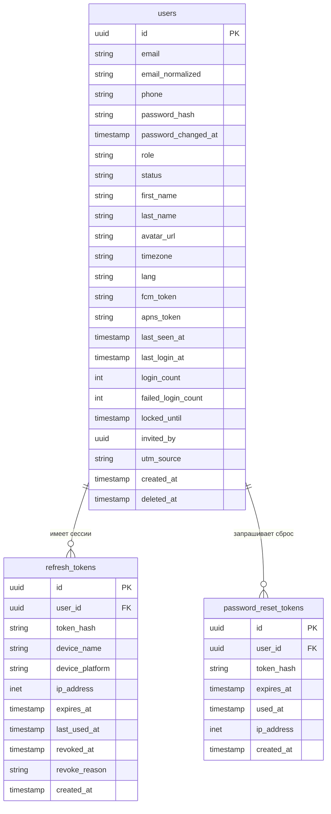

---

## users-service

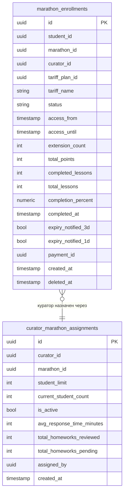

---

## courses-service

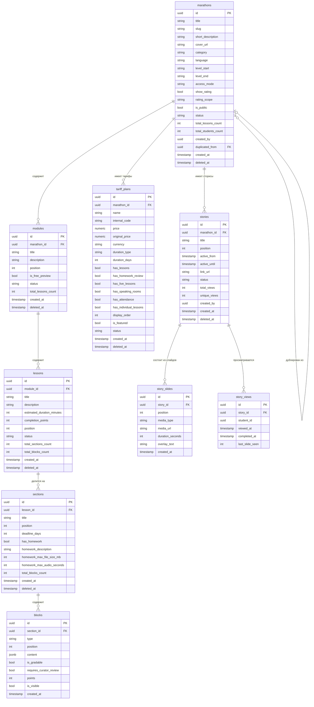

---

## progress-service

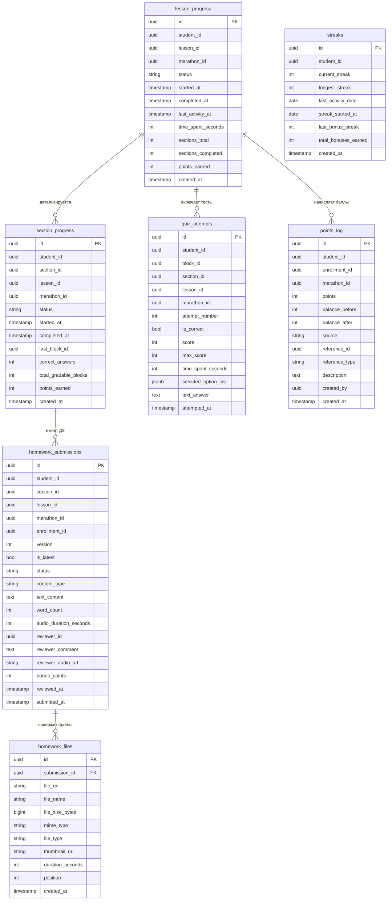

---

## chat-service

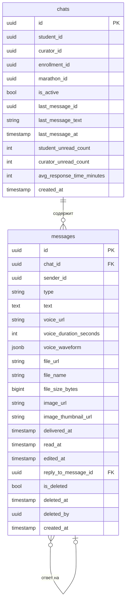

---

## payment-service

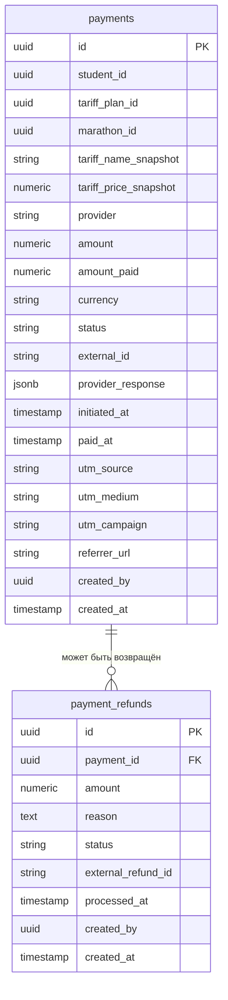

---

## speaking-service

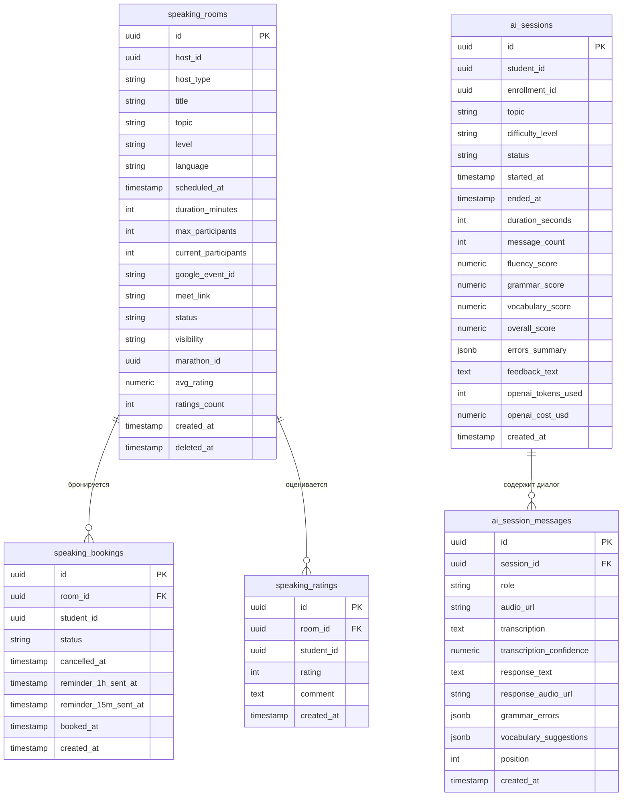

---

## vocab-service

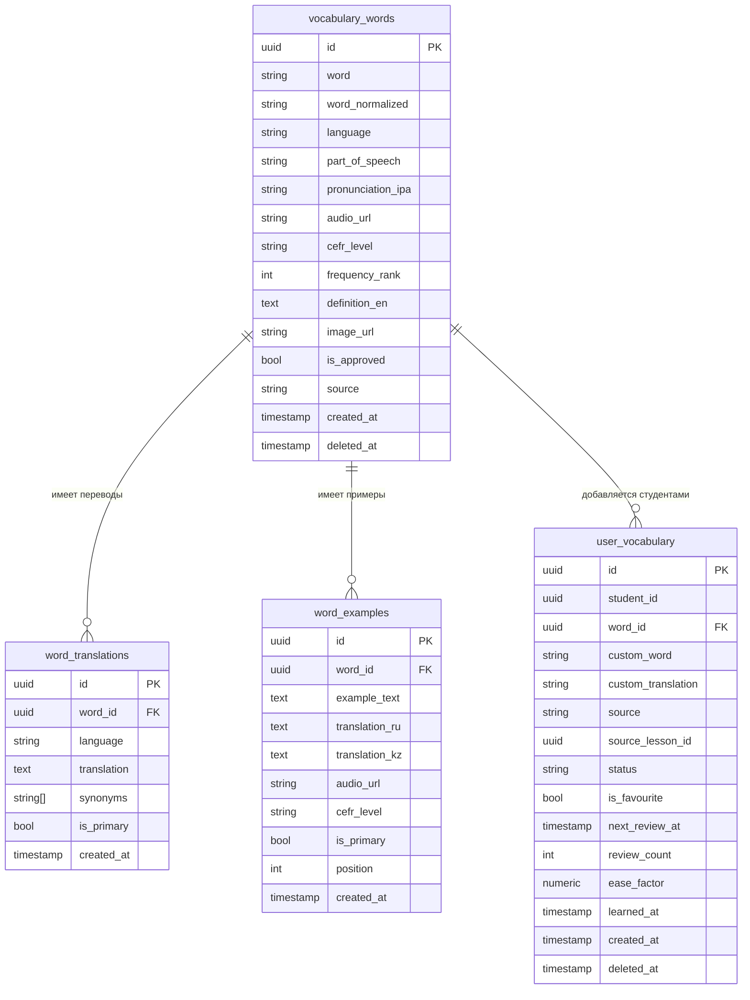

---

## cefr-service

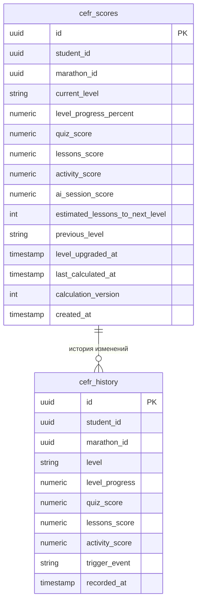

---

## notification-service

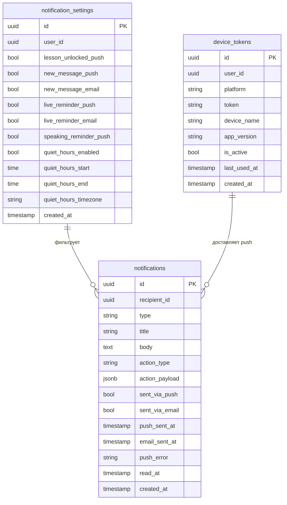

---

## attendance-service

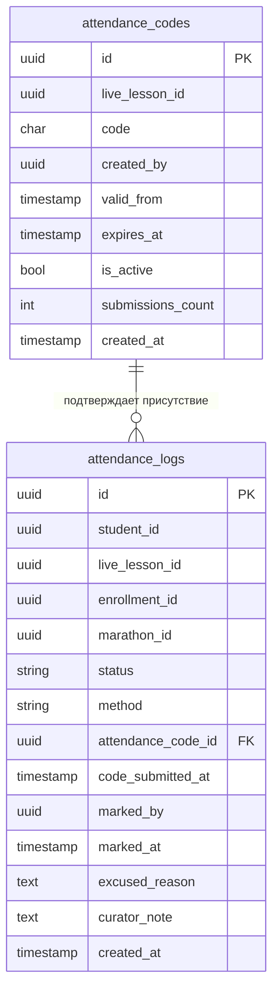

---

## calendar-service

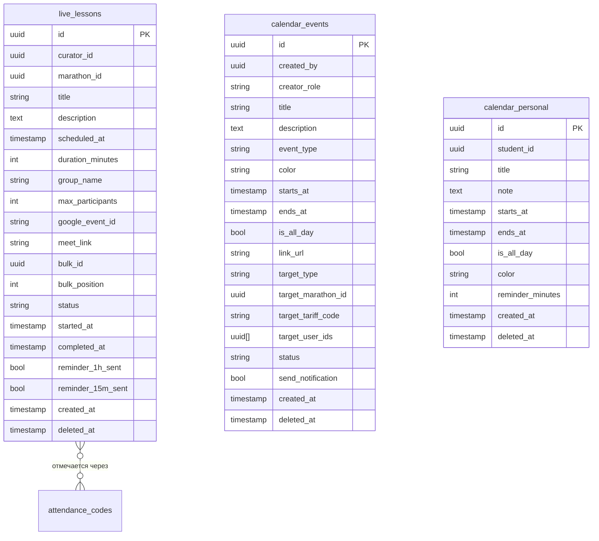

---

## files-service

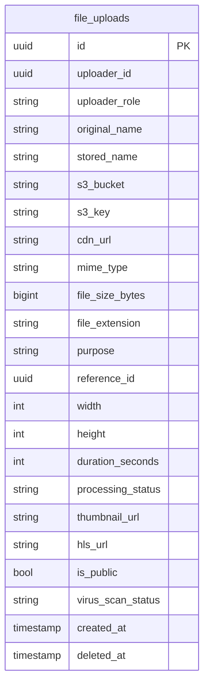

---

## Межсервисные связи (логические)

Физических FK между сервисами нет — только логические связи через ID. Данные другого сервиса получаются через API.

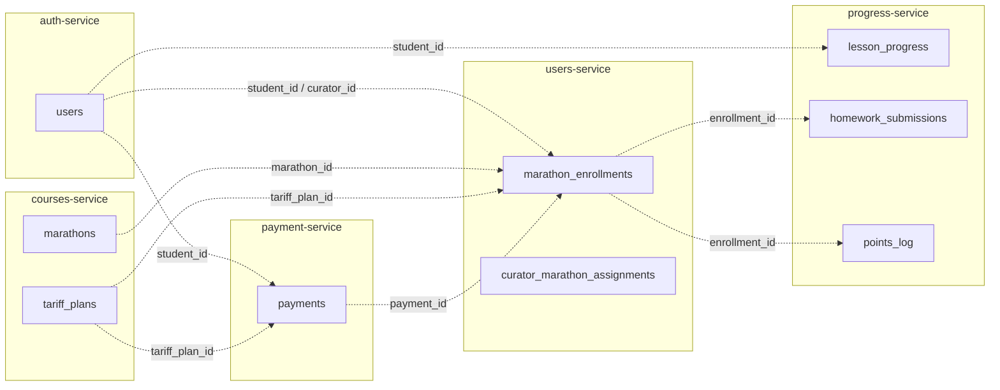
