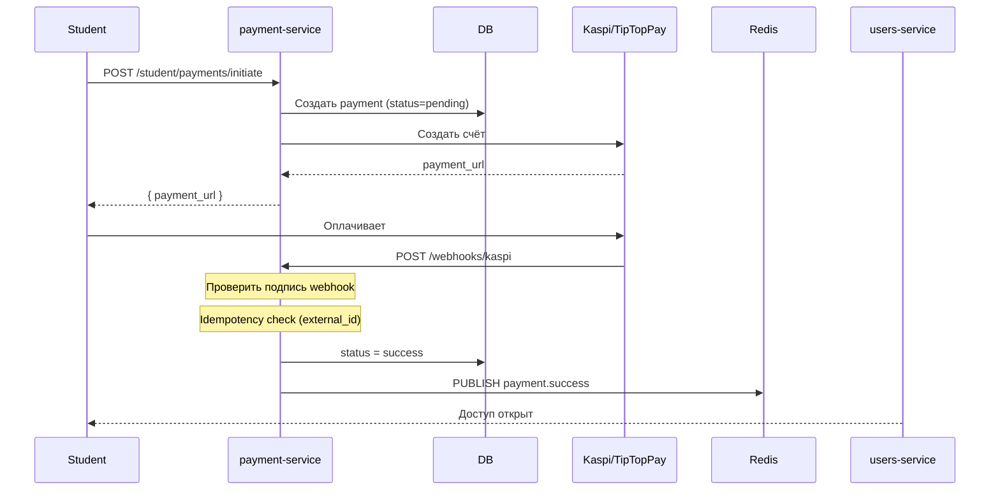
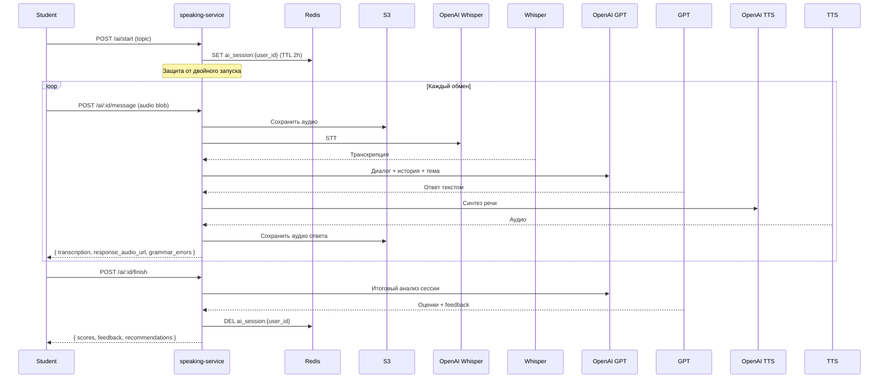
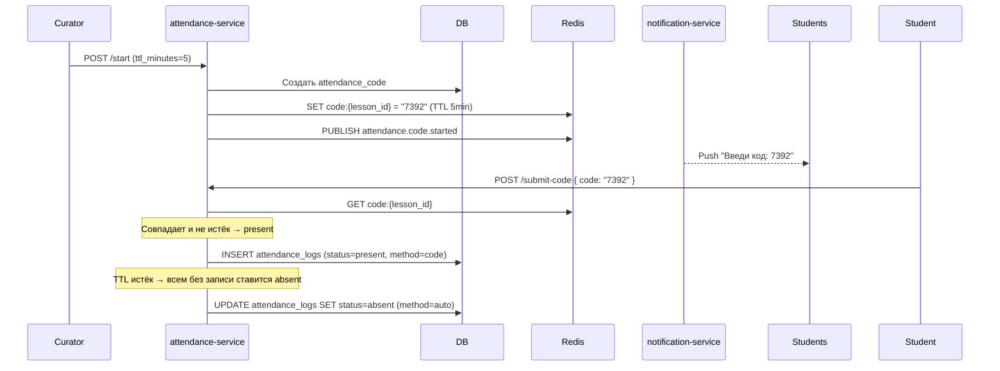

# Микросервисы

Все сервисы написаны на **Go 1.21+** с Gin Framework. Каждый сервис — отдельный Docker-контейнер, своя PostgreSQL схема, независимый деплой.

---

## Структура каждого сервиса

```
{service-name}/
├── cmd/
│   └── main.go                 # Точка входа: инициализация, graceful shutdown
├── internal/
│   ├── config/
│   │   └── config.go           # Конфиг из env-переменных (viper / envconfig)
│   ├── handler/
│   │   ├── http.go             # Gin роутер, регистрация маршрутов
│   │   └── {domain}_handler.go # Хендлеры по доменам
│   ├── service/
│   │   └── {domain}_service.go # Бизнес-логика. Не знает про HTTP.
│   ├── repository/
│   │   └── {domain}_repo.go    # Все SQL запросы. Не знает про бизнес-логику.
│   ├── middleware/
│   │   ├── auth.go             # Проверка X-User-ID / X-User-Role заголовков
│   │   ├── rbac.go             # RequireRole("admin", "curator")
│   │   ├── request_id.go       # Прокидывание X-Request-ID в контекст
│   │   └── recovery.go         # Panic recovery → 500
│   ├── model/
│   │   └── {domain}.go         # GORM модели и DTO
│   └── pubsub/
│       ├── publisher.go        # Публикация событий в Redis
│       └── subscriber.go       # Подписка на события
├── migrations/
│   ├── 001_init.up.sql
│   └── 001_init.down.sql
├── Dockerfile
├── .env.example
└── config.yaml
```

### Graceful Shutdown
Каждый сервис обрабатывает SIGTERM: перестаёт принимать новые запросы, дожидается завершения текущих (таймаут 30 сек), закрывает соединения с БД и Redis.

### RBAC Middleware
```go
// Только для Admin
router.GET("/admin/users", middleware.RequireRole("admin"), handler.ListUsers)

// Для Admin и Curator
router.GET("/students", middleware.RequireRole("admin", "curator"), handler.ListStudents)

// Для Student
router.POST("/homework", middleware.RequireRole("student"), handler.SubmitHomework)
```

---

## auth-service

**Домен:** аутентификация, авторизация, управление сессиями.

### Зона ответственности
- Регистрация пользователей (email + password)
- Вход и выдача JWT access-токена (TTL 15 минут) + refresh-токена (TTL 7 дней)
- Обновление access-токена по refresh-токену
- Logout (отзыв refresh-токена)
- Сброс пароля через email (одноразовый токен TTL 1 час)
- Блокировка аккаунта после 5 неудачных попыток входа (на 15 минут)
- Инвалидация всех токенов при смене пароля

### JWT Payload
```json
{
  "sub": "user-uuid",
  "role": "student",
  "email": "user@example.com",
  "iat": 1700000000,
  "exp": 1700000900
}
```

### HTTP Endpoints
```
POST /auth/register         Регистрация (email, password, first_name, last_name)
POST /auth/login            Вход → access_token + refresh_token
POST /auth/refresh          Обновить access_token по refresh_token
POST /auth/logout           Отозвать refresh_token
POST /auth/forgot-password  Запросить сброс пароля → письмо с токеном
POST /auth/reset-password   Установить новый пароль по токену из письма
GET  /auth/me               Данные текущего пользователя
```

### Взаимодействие с другими сервисами
- При регистрации: `PUBLISH user.created` → notification-service отправляет welcome email
- Refresh-токены хранятся в Redis с TTL 7 дней (быстрая проверка без БД)
- Счётчик неудачных попыток: Redis INCR с TTL 15 минут

---

## users-service

**Домен:** профили пользователей, зачисление на марафоны, назначение кураторов.

### Зона ответственности
- CRUD профилей (admin, curator, student)
- Загрузка аватаров → S3
- Управление статусами студентов (active / deactivated / blocked)
- Зачисление студентов на марафоны (marathon_enrollments)
- Назначение и смена кураторов
- Продление доступа к марафону
- Импорт студентов через CSV
- Отправка приглашений по email (логин + пароль)
- Просмотр credentials студента администратором

### HTTP Endpoints
```
GET    /admin/users                        Список пользователей (поиск, фильтры)
POST   /admin/users                        Создать пользователя вручную
GET    /admin/users/:id                    Карточка пользователя
PUT    /admin/users/:id                    Обновить профиль
DELETE /admin/users/:id                    Soft delete
POST   /admin/users/:id/block              Заблокировать / разблокировать
GET    /admin/users/:id/credentials        Логин и пароль студента
POST   /admin/users/:id/send-invite        Отправить письмо-приглашение
POST   /admin/users/import                 Импорт из CSV

GET    /admin/enrollments                  Список зачислений
POST   /admin/enrollments                  Записать студента на марафон
GET    /admin/enrollments/:id              Карточка зачисления
POST   /admin/enrollments/:id/extend       Продлить доступ
POST   /admin/enrollments/:id/assign-curator Назначить куратора

GET    /curator/students                   Мои студенты (только свои)
GET    /curator/students/:id               Карточка своего студента

GET    /student/profile                    Свой профиль
PUT    /student/profile                    Обновить профиль (имя, аватар, язык, timezone)
PUT    /student/profile/password           Сменить пароль
GET    /student/my-marathons               Мои марафоны с прогрессом и датами доступа
```

### Взаимодействие
- Слушает `payment.success` → активирует marathon_enrollment (status: pending → active)
- Слушает `access.expired` (от scheduler) → ставит enrollment status = expired
- При назначении куратора: `PUBLISH curator.assigned` → notification-service уведомляет куратора

---

## courses-service

**Домен:** учебный контент — марафоны, модули, уроки, разделы, блоки, тарифы, сторисы.

### Зона ответственности
- Полный CRUD иерархии: марафон → модуль → урок → раздел → блок
- Drag-and-drop порядок блоков (поле `position`)
- Режимы прохождения: open / sequential / with_review
- Дублирование марафона (копия без студентов и кураторов)
- Публикация / архивирование марафонов и уроков
- Конструктор тарифных планов (состав, скидки, период)
- Публичная страница курса (описание, программа, тарифы)
- Сторисы (создание, таргетинг, порядок, статистика просмотров)

### Архитектура контента
```
Marathon
└── Module (позиция, статус)
    └── Lesson (позиция, баллы за завершение, статус)
        └── Section (позиция, дедлайн, настройки ДЗ)
            └── Block (позиция, тип, JSONB content, баллы)
```

### HTTP Endpoints
```
# Марафоны
GET    /admin/marathons                    Список (поиск, фильтр по статусу/категории/языку)
POST   /admin/marathons                    Создать
GET    /admin/marathons/:id               Полная карточка
PUT    /admin/marathons/:id               Обновить
POST   /admin/marathons/:id/publish       Опубликовать (draft → published)
POST   /admin/marathons/:id/archive       Архивировать
POST   /admin/marathons/:id/duplicate     Дублировать

# Структура контента
GET    /admin/marathons/:id/modules       Модули марафона
POST   /admin/marathons/:id/modules       Создать модуль
PUT    /admin/modules/:id                 Обновить модуль
DELETE /admin/modules/:id                 Удалить модуль
PUT    /admin/modules/reorder             Изменить порядок модулей

GET    /admin/modules/:id/lessons         Уроки модуля
POST   /admin/modules/:id/lessons         Создать урок
PUT    /admin/lessons/:id                 Обновить урок
DELETE /admin/lessons/:id                 Удалить урок

GET    /admin/lessons/:id/sections        Разделы урока
POST   /admin/lessons/:id/sections        Создать раздел
PUT    /admin/sections/:id                Обновить раздел

GET    /admin/sections/:id/blocks         Блоки раздела
POST   /admin/sections/:id/blocks         Создать блок
PUT    /admin/blocks/:id                  Обновить блок
DELETE /admin/blocks/:id                  Удалить блок
PUT    /admin/blocks/reorder              Изменить порядок блоков

# Тарифы
GET    /admin/marathons/:id/tariffs        Тарифы марафона
POST   /admin/marathons/:id/tariffs        Создать тариф
PUT    /admin/tariffs/:id                  Обновить тариф
DELETE /admin/tariffs/:id                  Архивировать тариф

# Публичные (без авторизации)
GET    /public/marathons                   Публичный список курсов
GET    /public/marathons/:slug             Публичная страница курса с тарифами

# Студент
GET    /student/marathons                  Мои марафоны
GET    /student/marathons/:id/modules      Структура курса (с учётом доступа)
GET    /student/lessons/:id                Урок с блоками
GET    /student/marathons/:id/search       Поиск урока по названию

# Сторисы
GET    /admin/stories                      Список сторисов
POST   /admin/stories                      Создать сторис
PUT    /admin/stories/:id                  Обновить
DELETE /admin/stories/:id                  Удалить
GET    /student/stories                    Активные сторисы для студента
POST   /student/stories/:id/view           Отметить просмотр
```

### Логика доступа к урокам
При запросе `GET /student/marathons/:id/modules` сервис проверяет `access_mode` марафона:

- **open** — все уроки возвращаются как доступные
- **sequential** — урок доступен если предыдущий имеет `lesson_progress.status = completed`
- **with_review** — урок доступен если у предыдущего раздела с ДЗ есть `homework_submissions.status = approved`

Проверка делается через вызов progress-service API (синхронно).

---

## progress-service

**Домен:** прогресс студентов, домашние задания, баллы, рейтинг.

### Зона ответственности
- Трекинг прогресса по урокам и разделам
- Приём и хранение домашних заданий (с версионированием)
- Проверка ДЗ куратором (принять / на доработку / отклонить)
- Начисление баллов с полным audit log
- Streak-трекер
- Рейтинг студентов по марафону
- Разблокировка следующего урока по режиму марафона

### Логика начисления баллов
Все начисления атомарны — `points_log` запись + обновление `marathon_enrollments.total_points` в одной транзакции.

| Событие | Баллы | Условие |
|---|---|---|
| Урок завершён | 10 (настраивается в `lessons.completion_points`) | `lesson_progress.status` → completed |
| ДЗ принято | 20 | `homework_submissions.status` → approved |
| ДЗ принято с бонусом | 20 + бонус куратора | `bonus_points > 0` |
| Тест пройден правильно | 5–15 (из `blocks.points`) | `quiz_attempts.is_correct = true` |
| Live урок (присутствовал) | 15 | `attendance_logs.status = present` |
| Streak 7 дней | 50 | `streaks.current_streak % 7 = 0` |

### HTTP Endpoints
```
# Прогресс
POST   /student/lessons/:id/start          Начать урок (создать lesson_progress)
POST   /student/sections/:id/complete      Завершить раздел
POST   /student/lessons/:id/complete       Завершить урок → начислить баллы
POST   /student/blocks/:id/heartbeat       Heartbeat (раз в 30 сек) → обновить time_spent
POST   /student/blocks/:id/answer          Ответить на интерактивный блок

# Домашние задания
GET    /student/homework                   Мои ДЗ (со статусами)
POST   /student/sections/:id/homework      Отправить ДЗ (файлы + текст + аудио)
GET    /student/homework/:id               Детали ДЗ с комментарием куратора

GET    /curator/homework                   ДЗ моих студентов (фильтр: pending/revision/all)
GET    /curator/homework/:id               Детали ДЗ для проверки
POST   /curator/homework/:id/review        Проверить ДЗ (статус + комментарий + бонус)

GET    /admin/marathons/:id/results        Результаты всех студентов марафона
GET    /admin/students/:id/progress        Прогресс студента по всем марафонам

# Рейтинг
GET    /student/marathons/:id/leaderboard  Рейтинг марафона
GET    /student/marathons/:id/my-rank      Моё место в рейтинге
```

### Публикуемые события
```
lesson.completed    → { student_id, lesson_id, marathon_id, points_earned }
homework.submitted  → { student_id, homework_id, curator_id, section_id }
homework.reviewed   → { student_id, homework_id, status, points_earned }
lesson.unlocked     → { student_id, lesson_id }    ← при sequential/with_review
streak.achieved     → { student_id, streak_count }
```

---

## chat-service

**Домен:** real-time чат куратор ↔ студент.

### Зона ответственности
- WebSocket соединения (gorilla/websocket)
- 1:1 чаты куратор ↔ студент
- Типы сообщений: текст, изображение, файл, голосовое
- Статусы доставки: sent ✓ / read ✓✓
- Индикатор typing
- Модерация (Admin: просмотр всех чатов, удаление сообщений)
- Аналитика времени ответа кураторов

### Масштабирование WebSocket
При нескольких экземплярах сервиса WebSocket соединения распределены по разным инстансам. Сообщения синхронизируются через Redis Pub/Sub:

```
Student WS → instance-1 → PUBLISH chat:{chat_id} → instance-2 → Curator WS
```

Каждый экземпляр подписан на каналы своих активных соединений.

### WebSocket Protocol
Клиент устанавливает WS соединение с JWT токеном в query param:
```
wss://api.1bilim.kz/ws?token={access_token}
```

Формат сообщений (JSON):
```json
// Клиент → Сервер
{ "type": "send_message", "chat_id": "uuid", "content_type": "text", "text": "Hello" }
{ "type": "typing_start", "chat_id": "uuid" }
{ "type": "typing_stop", "chat_id": "uuid" }
{ "type": "message_read", "message_id": "uuid" }

// Сервер → Клиент
{ "type": "new_message", "message": { ...message object } }
{ "type": "typing", "chat_id": "uuid", "user_id": "uuid" }
{ "type": "message_delivered", "message_id": "uuid" }
{ "type": "homework_reviewed", "homework_id": "uuid", "status": "approved" }
{ "type": "lesson_unlocked", "lesson_id": "uuid" }
```

### HTTP Endpoints
```
# Чаты
GET    /curator/chats                      Список чатов куратора (с непрочитанными)
GET    /student/chat                       Чат с моим куратором
GET    /admin/chats                        Все чаты (мониторинг)

# Сообщения (REST для истории, WS для real-time)
GET    /chats/:id/messages                 История сообщений (пагинация cursor-based)
DELETE /admin/messages/:id                 Удалить сообщение (модерация)

# Аналитика
GET    /admin/chats/analytics              Время ответа кураторов
```

### Слушает события
```
homework.reviewed → отправить WS push студенту о результате
lesson.unlocked   → отправить WS push студенту об открытии урока
```

---

## payment-service

**Домен:** оплата, тарифы, транзакции, UTM-атрибуция.

### Зона ответственности
- Инициация оплаты через Kaspi.kz и TipTopPay
- Обработка webhook от платёжных систем (идемпотентно)
- Ручное предоставление / отзыв доступа администратором
- История транзакций с фильтрами
- Возвраты
- UTM-атрибуция источника каждой покупки
- Отчёт по источникам покупок

### Флоу оплаты


### Идемпотентность webhook
Kaspi может прислать webhook несколько раз. Защита:
```sql
-- При обработке webhook проверяем:
SELECT id FROM payments WHERE external_id = $1 AND status = 'success';
-- Если нашли — игнорируем дубль, возвращаем 200 OK
```

### HTTP Endpoints
```
# Студент
POST   /student/payments/initiate          Начать оплату (tariff_id, provider)
GET    /student/payments/history           История моих платежей
GET    /student/payments/:id/status        Статус платежа (для polling)

# Webhooks (без авторизации, проверка по подписи)
POST   /webhooks/kaspi                     Webhook от Kaspi.kz
POST   /webhooks/tiptoppay                 Webhook от TipTopPay

# Admin
GET    /admin/payments                     Все транзакции (фильтры по дате, статусу, источнику)
POST   /admin/payments/manual              Ручное предоставление доступа
POST   /admin/payments/:id/refund          Возврат
GET    /admin/payments/utm-report          Отчёт по UTM источникам
```

### Публикуемые события
```
payment.success → { student_id, marathon_id, tariff_plan_id, enrollment_id }
payment.failed  → { student_id, payment_id }
```

---

## speaking-service

**Домен:** Speaking Rooms (студент-студент), AI Speaking тренер.

### Зона ответственности
- CRUD Speaking Rooms
- Бронирование мест с проверкой лимита (race condition защита через Redis)
- Интеграция с Google Calendar API (создание события + Meet ссылки)
- AI Speaking сессии: GPT диалог + Whisper STT + TTS
- Защита от двойного AI-запуска (Redis lock)
- Pronunciation scoring
- История и рейтинги сессий
- Bulk создание комнат на неделю вперёд

### Защита от race condition при бронировании
```
Redis: INCR speaking_room:{id}:bookings
Если результат > max_participants → DECR и вернуть ошибку "Мест нет"
```

### HTTP Endpoints
```
# Speaking Rooms (студент-студент)
GET    /student/speaking/rooms             Доступные комнаты (фильтры: дата, уровень, тема)
POST   /student/speaking/rooms             Создать комнату → Google Calendar event
POST   /student/speaking/rooms/bulk        Создать несколько комнат сразу
GET    /student/speaking/rooms/:id         Детали комнаты
POST   /student/speaking/rooms/:id/book    Забронировать место
DELETE /student/speaking/rooms/:id/book    Отменить бронь
GET    /student/speaking/rooms/:id/join    Получить Meet-ссылку (только при наличии брони)
POST   /student/speaking/rooms/:id/rate    Оценить сессию (1-5 + комментарий)
GET    /student/speaking/history           История моих сессий

# Куратор создаёт комнаты для своих групп
POST   /curator/speaking/rooms             Создать комнату
POST   /curator/speaking/rooms/bulk        Bulk создание

# AI Speaking тренер
POST   /student/speaking/ai/start          Начать AI сессию (topic, difficulty)
POST   /student/speaking/ai/:id/message    Отправить аудио → получить ответ AI
POST   /student/speaking/ai/:id/finish     Завершить → получить анализ
GET    /student/speaking/ai/history        История AI сессий
```

### AI Speaking флоу


---

## vocab-service

**Домен:** словарь платформы и личный словарь студента.

### Зона ответственности
- Глобальная база слов с CEFR-уровнями
- CRUD слов через Adminку (вручную)
- Автоподстановка перевода/примера через OpenAI при добавлении студентом
- TTS произношения
- Личный словарь студента (добавить, избранное, изучено)
- Фильтры словаря: все / избранные / изученные / по уровню

### HTTP Endpoints
```
# Admin — управление базой слов
GET    /admin/vocabulary                   Список слов (поиск, фильтр по уровню)
POST   /admin/vocabulary                   Добавить слово вручную
PUT    /admin/vocabulary/:id               Обновить слово
DELETE /admin/vocabulary/:id               Удалить слово

# Студент — личный словарь
GET    /student/vocabulary                 Мой словарь (фильтры: статус, уровень, избранные)
POST   /student/vocabulary                 Добавить слово (word → автоперевод через OpenAI)
DELETE /student/vocabulary/:id             Удалить из словаря
PUT    /student/vocabulary/:id/status      Обновить статус (learned / learning)
POST   /student/vocabulary/:id/favourite   Добавить в избранное
DELETE /student/vocabulary/:id/favourite   Убрать из избранного
```

### Автоперевод при добавлении слова студентом
```
POST /student/vocabulary { "word": "ubiquitous" }

1. Проверить vocabulary_words WHERE word_normalized = 'ubiquitous'
2. Если нашли → взять из базы
3. Если нет → запросить OpenAI:
   - translation_ru, translation_kz
   - definition_en
   - example + example_translation
   - part_of_speech, cefr_level
4. Сохранить в vocabulary_words (is_approved=false, source='openai')
5. Сохранить в user_vocabulary для студента
6. Асинхронно: сгенерировать TTS audio → S3
```

---

## cefr-service

**Домен:** расчёт и отображение уровня владения языком (CEFR A1–C2).

### Зона ответственности
- Пересчёт уровня при каждом значимом событии
- Отображение текущего уровня + прогресс до следующего
- Прогноз уроков до повышения уровня
- История изменений уровня (для графика прогресса)

### Алгоритм расчёта уровня
Составной скоринг из нескольких компонент. Веса настраиваются через конфиг (не хардкод):

```
quiz_score      = средний % правильных ответов на тесты         × 0.40
lessons_score   = завершённые_уроки / total_lessons              × 0.35
activity_score  = streak_factor + time_in_system_factor          × 0.15
ai_score        = средний overall_score из AI сессий (если есть) × 0.10

composite_score = взвешенная сумма

Маппинг composite_score → CEFR:
  0–20%   → A1
  20–35%  → A2
  35–50%  → B1
  50–65%  → B2
  65–80%  → C1
  80–100% → C2
```

`level_progress_percent` = позиция внутри текущего диапазона (0–100%).

### HTTP Endpoints
```
GET    /student/cefr                       Текущий уровень + прогресс + прогноз
GET    /student/cefr/history               История изменений уровня
GET    /curator/students/:id/cefr          CEFR студента (для куратора)
GET    /admin/marathons/:id/cefr-stats     Распределение уровней по марафону
```

### Слушает события
```
lesson.completed  → пересчитать CEFR для student_id
homework.reviewed → пересчитать если approved
```

---

## notification-service

**Домен:** все уведомления платформы (push + email).

### Зона ответственности
- Push через FCM (Android) и APNs (iOS)
- Email через SendGrid / AWS SES
- Email отправляется только если `users.last_seen_at < now() - 24h`
- Хранение истории уведомлений
- Настройки уведомлений студента (тихие часы, тогглы)
- Критические уведомления (ДЗ проверено, оплата, истечение) нельзя отключить

### Слушает все события
```
user.created           → welcome email
payment.success        → email + push студенту
payment.failed         → push студенту
lesson.completed       → push если новый урок открылся
homework.submitted     → push куратору
homework.reviewed      → email + push студенту (критическое)
message.sent           → push (email если неактивен 24ч)
attendance.code.started→ push студентам (критическое)
access.expiring        → email + push студенту (критическое)
access.expired         → email + push студенту (критическое)
live_lesson.reminder   → email + push студенту
speaking_room.reminder → email + push студенту
student.inactive       → push куратору
curator.assigned       → push куратору
streak.achieved        → push студенту
```

### HTTP Endpoints
```
GET    /student/notifications              Список уведомлений (пагинация)
POST   /student/notifications/read-all    Отметить все как прочитанные
PUT    /student/notifications/settings    Обновить настройки уведомлений
GET    /student/notifications/settings    Текущие настройки
```

---

## attendance-service

**Домен:** отметка посещаемости на Live уроках.

### Зона ответственности
- Генерация 4-значных кодов для отметки (TTL задаёт куратор)
- Валидация кода от студента
- Ручная отметка куратором
- Автоматическое выставление "Отсутствовал" по истечении TTL кода
- Аналитика посещаемости (по студенту, по уроку)
- Экспорт в Excel

### HTTP Endpoints
```
# Куратор
POST   /curator/live-lessons/:id/attendance/start   Запустить отметку (создать код)
DELETE /curator/live-lessons/:id/attendance/stop    Остановить (деактивировать код)
POST   /curator/live-lessons/:id/attendance/manual  Ручная отметка студента
GET    /curator/live-lessons/:id/attendance         Сводная таблица урока
GET    /curator/students/:id/attendance             История посещаемости студента
GET    /curator/attendance/export                   Экспорт в Excel

# Студент
POST   /student/attendance/submit-code              Ввести код присутствия
GET    /student/attendance                          Моя статистика посещаемости
```

### Флоу кода


---

## calendar-service

**Домен:** расписание платформы — Live уроки, события, личный календарь студента.

### Зона ответственности
- CRUD Live уроков куратора (+ Google Calendar API → Meet ссылка)
- Bulk создание уроков на неделю/месяц вперёд
- События платформы (вебинары, дедлайны, экзамены) с таргетингом
- Личные события студентов
- Напоминания (за 1 час и 15 минут) — публикует события для notification-service

### HTTP Endpoints
```
# Live уроки (куратор)
GET    /curator/live-lessons               Мои Live уроки
POST   /curator/live-lessons               Создать урок → Google Calendar
POST   /curator/live-lessons/bulk          Создать несколько уроков
PUT    /curator/live-lessons/:id           Обновить
DELETE /curator/live-lessons/:id           Отменить
GET    /curator/live-lessons/:id/attendance Посещаемость урока (из attendance-service)

# Расписание студента
GET    /student/schedule                   События на период (month/week/day)
GET    /student/live-lessons/:id           Детали Live урока + Meet ссылка

# События платформы (admin/curator)
GET    /admin/calendar-events              Список событий
POST   /admin/calendar-events              Создать событие (с таргетингом)
PUT    /admin/calendar-events/:id          Обновить
DELETE /admin/calendar-events/:id          Удалить

# Личные события (студент)
GET    /student/calendar/personal          Мои личные события
POST   /student/calendar/personal          Создать личное событие
PUT    /student/calendar/personal/:id      Обновить
DELETE /student/calendar/personal/:id      Удалить
```

### Google Calendar интеграция
```
POST /curator/live-lessons

1. Сохранить live_lesson в БД (status=scheduled)
2. Google Calendar API: events.insert
   - summary: title
   - start/end: scheduled_at + duration
   - attendees: email всех студентов марафона
   - conferenceData.createRequest → генерирует Meet ссылку
3. Сохранить google_event_id и meet_link в live_lesson
4. Вернуть ответ куратору
```

---

## stories-service

**Домен:** объявления в формате Stories (Instagram-like карусель).

### Зона ответственности
- CRUD сторисов с медиа (изображение / видео до 60 сек)
- Мультислайдовые сторисы
- Период активности (дата начала — дата окончания)
- Таргетинг: вся платформа или конкретный марафон
- Порядок отображения
- Статистика просмотров (total / unique)
- Отметка "просмотрено" для студента

### HTTP Endpoints
```
# Admin
GET    /admin/stories                      Список сторисов
POST   /admin/stories                      Создать сторис
PUT    /admin/stories/:id                  Обновить
DELETE /admin/stories/:id                  Удалить
GET    /admin/stories/:id/stats            Статистика просмотров

# Студент
GET    /student/stories                    Активные сторисы (с флагом viewed)
POST   /student/stories/:id/view           Отметить просмотр
```

---

## Паттерны устойчивости

### Idempotency Keys
Все мутирующие операции с внешними сторонами (оплата, Google Calendar, отправка push) используют idempotency keys — повторный запрос с тем же ключом возвращает кэшированный результат без повторного выполнения.

### Retry с exponential backoff
Вызовы к внешним API (OpenAI, Google Calendar, Kaspi) оборачиваются в retry с экспоненциальной задержкой: 1s → 2s → 4s → 8s. Максимум 3 попытки. После — ошибка логируется, задача уходит в очередь для ручного разбора.

### Fallback для некритичных операций
- OpenAI для автоперевода недоступен → вернуть слово без перевода, студент заполнит вручную
- TTS генерация упала → слово сохраняется без аудио, добавится позже
- Google Calendar API упал → Live урок создаётся без Meet ссылки, ссылка добавляется повторной попыткой (cron каждые 5 минут смотрит уроки без meet_link)

### Circuit Breaker (для будущего)
На MVP достаточно retry + fallback. При росте нагрузки — добавить Circuit Breaker (go-kit/circuitbreaker или Sony gobreaker) для OpenAI и Google Calendar.
