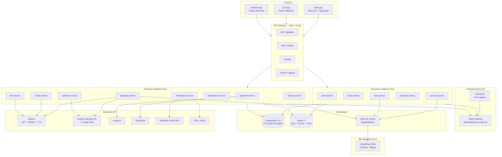
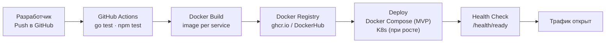

# Архитектура платформы 1Bilim

1Bilim построен на **микросервисной архитектуре** с чётким разделением по бизнес-доменам. Каждый сервис владеет своими данными, деплоится независимо и общается с другими через строго определённые интерфейсы.

Архитектура спроектирована так, чтобы текущий функционал (марафоны, чат, speaking, оплата) мог масштабироваться горизонтально без переписывания — добавлением новых сервисов, а не изменением существующих.

---

## Высокоуровневая схема



---

## Принципы архитектуры

### Database per service
Каждый микросервис владеет своей **отдельной PostgreSQL схемой**. Прямые JOIN между схемами разных сервисов запрещены — данные из другого сервиса получаются только через его API.

Это означает намеренную денормализацию: например, `marathon_title` сохраняется снапшотом в `payments`, чтобы payment-service не зависел от courses-service при формировании чека.

### Event-driven коммуникация
Сервисы общаются **асинхронно через Redis Pub/Sub** для всего что не требует немедленного ответа. Синхронный REST используется только между клиентом и сервисом через Gateway. Прямые синхронные вызовы сервис-в-сервис — только в исключительных случаях.

### Stateless services
Ни один сервис не хранит состояние в памяти процесса. Всё состояние — в PostgreSQL или Redis. Это позволяет запускать N экземпляров любого сервиса без дополнительной конфигурации.

### Идемпотентность
Все операции изменяющие состояние (оплата, начисление баллов, отметка посещаемости) идемпотентны — повторный вызов с теми же параметрами не создаёт дублей. Реализуется через уникальные ключи в БД и проверку на уровне сервиса.

### Single codebase mobile
Мобильные приложения — Flutter WebView оболочка. Единая кодовая база для iOS и Android. Вся бизнес-логика на фронте, нативный слой только для push-уведомлений (FCM / APNs) и WebView контейнера.

---

## Слои системы

```
┌─────────────────────────────────────────────────────┐
│                    КЛИЕНТЫ                          │
│         Web (React)  ·  iOS/Android (Flutter)       │
└───────────────────────┬─────────────────────────────┘
                        │ HTTPS / WSS
┌───────────────────────▼─────────────────────────────┐
│                  API GATEWAY                        │
│   JWT Auth  ·  Rate Limit  ·  Routing  ·  Logging   │
└───────────────────────┬─────────────────────────────┘
                        │ HTTP / WebSocket
┌───────────────────────▼─────────────────────────────┐
│               СЕРВИСНЫЙ СЛОЙ (Go)                   │
│  Основные: auth · users · courses · progress · chat  │
│  Фичевые:  payment · speaking · vocab · cefr · ...  │
└──────────┬──────────────────────────┬───────────────┘
           │ SQL                      │ Redis Pub/Sub
┌──────────▼──────────┐   ┌──────────▼───────────────┐
│   PostgreSQL 15+    │   │      Redis 7+             │
│  (schema per svc)   │   │  Кэш · Сессии · Pub/Sub  │
└─────────────────────┘   └──────────────────────────┘
```

---

## Потоки данных

### Синхронный поток (REST)
Используется для запросов требующих немедленного ответа клиенту.

```
Client → API Gateway → Service → PostgreSQL/Redis → Response
```

Примеры: загрузка урока, отправка сообщения в чат, получение списка марафонов.

### Асинхронный поток (Pub/Sub)
Используется когда результат действия нужен не клиенту, а другому сервису.

```
Service A → Redis Publish → Channel → Service B Subscribe → Action
```

Примеры: после оплаты открыть доступ, после завершения урока пересчитать CEFR, после проверки ДЗ отправить уведомление.

### Real-time поток (WebSocket)
Только для chat-service. Несколько экземпляров chat-service синхронизируются через Redis Pub/Sub — сообщение полученное любым экземпляром доставляется нужному WebSocket соединению.

```
Client A → WebSocket → chat-service instance 1
                            ↕ Redis Pub/Sub
Client B → WebSocket → chat-service instance 2
```

---

## Таблица событий Pub/Sub

Полный список событий циркулирующих между сервисами:

| Канал | Publisher | Subscribers | Описание |
|---|---|---|---|
| `user.created` | auth-service | notification-service | Новый пользователь — welcome email |
| `payment.success` | payment-service | users-service, notification-service | Оплата прошла — открыть доступ |
| `payment.failed` | payment-service | notification-service | Оплата не прошла — уведомить |
| `lesson.completed` | progress-service | cefr-service, notification-service | Урок завершён |
| `lesson.unlocked` | progress-service | chat-service | Следующий урок открыт — WS push студенту |
| `homework.submitted` | progress-service | notification-service | ДЗ отправлено — уведомить куратора |
| `homework.reviewed` | progress-service | notification-service, chat-service | ДЗ проверено — уведомить студента |
| `message.sent` | chat-service | notification-service | Новое сообщение — push если неактивен |
| `attendance.code.started` | attendance-service | notification-service | Код отметки — push всем студентам урока |
| `access.expiring` | scheduler | notification-service | Доступ истекает через 3д / 1д / сегодня |
| `access.expired` | scheduler | users-service, notification-service | Доступ истёк — деактивировать |
| `live_lesson.reminder` | scheduler | notification-service | Напоминание о Live уроке за 1ч / 15мин |
| `speaking_room.reminder` | scheduler | notification-service | Напоминание о Speaking Room за 1ч / 15мин |
| `student.inactive` | scheduler | notification-service | Студент неактивен 3+ дней — уведомить куратора |
| `streak.achieved` | progress-service | notification-service | Достигнут streak 7 дней |

---

## Scheduler — cron-задачи

Отдельный лёгкий Go-сервис. Не имеет HTTP API. Только публикует события в Redis Pub/Sub по расписанию.

| Задача | Расписание | Действие |
|---|---|---|
| Проверка истекающих доступов | каждые 10 минут | Публикует `access.expiring` / `access.expired` |
| Напоминания о Live уроках | каждые 5 минут | Публикует `live_lesson.reminder` |
| Напоминания о Speaking Rooms | каждые 5 минут | Публикует `speaking_room.reminder` |
| Неактивные студенты | раз в день в 10:00 | Публикует `student.inactive` |
| Streak бонусы | раз в день в 00:05 | Начисляет бонусные баллы |
| Обновление leaderboard | каждые 5 минут | REFRESH MATERIALIZED VIEW |
| Очистка истёкших токенов | раз в день в 03:00 | DELETE FROM refresh_tokens WHERE expires_at < now() |
| Деактивация старых кодов | каждую минуту | Закрывает attendance_codes с истёкшим expires_at |

---

## API Gateway

Nginx или Kong. Единая точка входа для всех клиентов.

**Зоны ответственности:**

| Функция | Реализация |
|---|---|
| JWT валидация | Проверка подписи и срока токена. Декодирование `user_id` и `role` в заголовки для сервисов |
| Routing | Маршрутизация по префиксу пути: `/auth/*` → auth-service, `/admin/*` → соответствующий сервис |
| Rate Limiting | По IP: 100 req/min для анонимных, 1000 req/min для авторизованных |
| HTTPS | TLS termination на уровне Gateway. Внутри кластера — HTTP |
| Access Log | Все запросы логируются: user_id, path, method, status, latency |
| CORS | Разрешённые origins настраиваются в конфиге |
| WebSocket | Проксирование WS соединений к chat-service |

**Заголовки передаваемые сервисам:**
```
X-User-ID: uuid
X-User-Role: admin | curator | student
X-Request-ID: uuid  ← для трассировки запроса через все сервисы
```

Сервисы доверяют этим заголовкам — не валидируют JWT самостоятельно.

---

## Observability

Минимально необходимый набор для production:

### Логирование
- Структурированные JSON логи в каждом сервисе (Go: `zap` или `slog`)
- Уровни: DEBUG / INFO / WARN / ERROR
- Обязательные поля в каждом лог-записи: `service`, `request_id`, `user_id`, `level`, `message`, `timestamp`
- Агрегация: stdout → Docker → любой log collector (Loki, ELK)

### Метрики
- Каждый сервис экспортирует `/metrics` в формате Prometheus
- Ключевые метрики: RPS, latency (p50/p95/p99), error rate, активные WS соединения
- Дашборд: Grafana

### Health checks
Каждый сервис обязан реализовать:
```
GET /health/live   → 200 если процесс запущен
GET /health/ready  → 200 если сервис готов принимать трафик (БД доступна, Redis доступен)
```
API Gateway роутит трафик только на ready экземпляры.

### Трассировка запросов
`X-Request-ID` генерируется на Gateway и передаётся во все сервисы. Присутствует в каждом лог-записи. Позволяет восстановить полный путь запроса через все сервисы по одному ID.

---

## Инфраструктура и деплой



**Docker Compose для MVP** — все сервисы на одном сервере, каждый в своём контейнере. PostgreSQL с несколькими схемами (не отдельными инстансами — это упрощение для старта, разделение при росте).

**Переменные окружения** — через `.env` файлы локально, GitHub Secrets в CI, environment variables в production. Никаких секретов в коде или Docker образах.

**Каждый сервис деплоится независимо** — изменение в payment-service не требует редеплоя courses-service.
